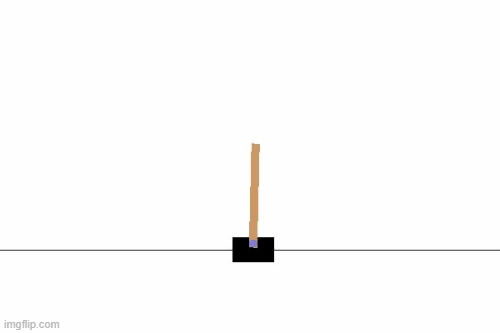
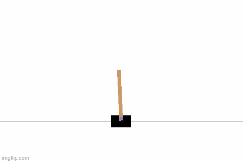
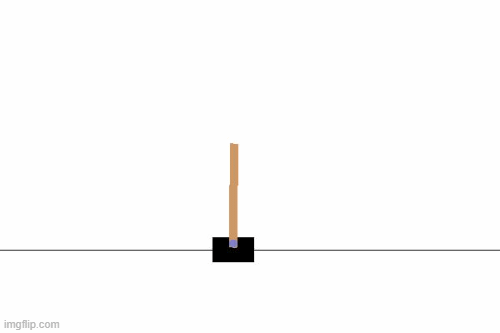
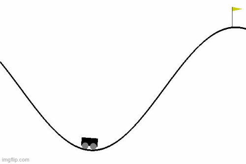
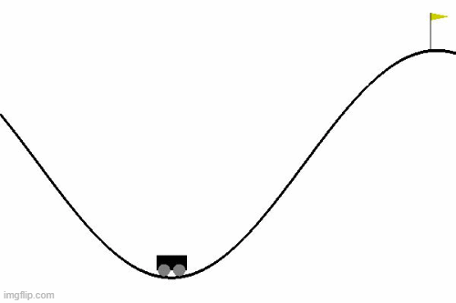
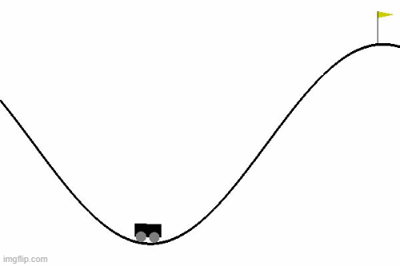

Name: James Dominic

Paper title: CURL: Contrastive Unsupervised Representations for Reinforcement Learning.

Implementation of choice: B. Apply the original method to a different field.

CURL Rainbow
=======
[](LICENSE.md)

**Status**: License attached from paper authors

This is an implementation of [CURL: Contrastive Unsupervised Representations for
Reinforcement Learning](https://arxiv.org/abs/2004.04136) coupled with the [Data Efficient Rainbow method](https://arxiv.org/abs/1906.05243) for Classic Control Environments.

To install all dependencies, use the 'enviro_curl.yml' file to create a conda environment. To do so use the below command. Make sure to navigate into the project folder before running this command.

```
conda env create -f environment.yml
```

Now activate conda environments using below comment.

```
conda activate curl
```

Install torchvision dependency. This was triggering an error while packaging with the yml file.

```
conda install -c pytorch torchvision
```

Run the following command with the game as an argument:

CartPole-v1
```
python main.py --T-max 100000 --game CartPole-v1 --V-max 200 --V-min -200 --max-episode-length 500
```

MountainCar-v0
```
python main.py --T-max 100000 --game MountainCar-v0 --V-max 20 --V-min -20 --max-episode-length 200
```

## Results:

CartPole-v1 after 10000 steps



CartPole-v1 after 50000 steps

 

CartPole-v1 after 100000 steps



MountainCar-v0 after 10000 steps



MountainCar-v0 after 50000 steps



MountainCar-v0 after 100000 steps

